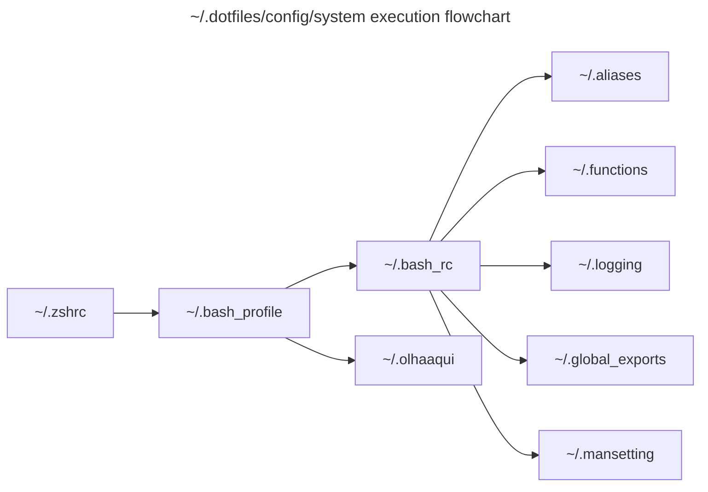

<h1 align="center">
  <a href="https://github.com/andreffs18/dotfiles">
    
  </a>
  <br><br>
</h1>

<h4 align="center">
 It takes the effort out of installing and configuring a new Mac.<br>Enjoy! 😄
</h4>

<p align="center">
  <a href="#">
    
  </a>
  <a href="https://github.com/andreffs18/dotfiles/blob/master/LICENSE.md">
    
  </a>
  <a href="https://twitter.com/andreffs18">
    
  </a>
</p>

<div align="center">
  <h4>
    <a href="#installation">Installation</a> |
    <a href="#functionality">Functionality</a> |
    <a href="#copypaste-dotfiles">Copy&Paste</a> |
    <a href="#credits">Credits</a>
  </h4>
</div>

<div align="center">
  <sub>Built with ❤︎ by <a href="https://andreffs.com">André Silva</a></sub>
</div>
<br>


## Installation

The first thing we should do is to make sure we have our system updated: **Apple menu () > About This Mac > Software Update**

Secondly, you just need to run the following one-liner:

```shell
bash -c "`curl -fsSL https://raw.githubusercontent.com/andreffs18/dotfiles/master/install.sh`"
```

In case you want to revert this installation just run the "reset.sh" script:

```shell
bash -c "`curl -fsSL https://raw.githubusercontent.com/andreffs18/dotfiles/master/reset.sh`"
```
> Note that this will only delete the `~/.dotfiles` folder and all symlinks. Xcode and all installed apps will still be installed.

To complete the installation, don't forget to setup the custom Terminal profile by importing the **~/.dotfiles/config/mac/andresilva.terminal** file into **Terminal > Preferences > Profiles > Import**.

> In case you can't find hidden folders, press the same "Command" + "Shift" + "." combination on a Finder window to toggle them visible.

Lastly, on the **Terminal > Preferences > General** Tab, check if the **"Shells open with:"** config is set to "Default login shell" with the `/bin/zsh` defined on the grayed out box. Otherwise, change it to "Command: ```/bin/zsh```".


## Functionality
- Custom Terminal configurations: zsh with [oh-my-zsh](https://github.com/robbyrussell/oh-my-zsh/wiki/Installing-ZSH) framework and [pure prompt](https://github.com/sindresorhus/pure) theme.
- Prefered IDE's for development: [PyCharm](https://www.jetbrains.com/pycharm/), [VisualStudio Code](https://code.visualstudio.com/) and [SublimeText2](https://www.sublimetext.com/).
- `kubectl` utils like: [kube-ps1](https://github.com/jonmosco/kube-ps1) prompt and [kubectx](https://github.com/ahmetb/kubectx) to quickly switch between contexts.
- Random emoji "Hello screen" animation.
- Util to open random Feedly "Saved for later" article 🤓
- Manage personal secrets using [Keybase](https://keybase.io/docs/command_line) command line tools

### Future
- Add dotfiles as brew tap so we can install from [```"$ brew install andreffs18-dotfiles"```](https://docs.brew.sh/How-to-Create-and-Maintain-a-Tap).
- Presentation alias that setup computer with key screen cast.
- `npm` usefull packages installation like, [terminalizer](https://github.com/faressoft/terminalizer) and [@vue/cli](https://cli.vuejs.org/guide/installation.html).

## Copy&Paste Dotfiles

If you want to have your own dotfiles and feel that this is a good example to start, you need to change a few things and be aware of how this is structured. It's pretty simple and easy to configure your own dotfiles, and the first thing you need to do is **fork this repo.** 😁

### Structure and Lifecycle

#### Directory structure

```
.
├── LICENSE.md
├── README.md
├── install.sh                  # Start point for the whole installation process
├── reset.sh                    # Rollback shell script that partially removes these dotfiles (WIP)
├── config
│   ├── apps                    # Setup and configure installed apps
│   │   ├── brew                #  Configure homebrew environment variables
│   │   ├── dockutil            #  Setup mac dock layout (which apps should appear on the dock)
│   │   ├── exercism            #  Setup exercism token and clone personal repo to ~/.projects folder
│   │   ├── keybase             #  Configure keybase and copy ~/.secrets dotfile to local machine
│   │   ├── oh-my-zsh           #  Define zsh and setup plugins for Oh-My-Zsh frame
│   │   ├── pure-prompt         #  Pure prompt theme for zsh
│   │   └── ssh                 #  Configure ssh agent
│   ├── git                     # My personal git configuration
│   │   ├── .gitconfig
│   │   └── .gitignore_global
│   ├── mac                     # General mac configs
│   │   ├── andresilva.terminal #  My terminal profile configuration
│   │   └── osx                 #  Mac Configuration (ui/ux, controls, shortcuts, etc)
│   ├── python                  # Python Configuration
│   │   └── flake8
│   └── system                  # dotenv files folder
│       ├── .aliases
│       ├── .bash_profile
│       ├── .bashrc
│       ├── .global_exports
│       ├── .functions
│       ├── .logging
│       ├── .mansettings
│       └── .zshrc
└── install                     # Folder for all apps installed via Homebrew and Mas.
    ├── Brewfile
    ├── Caskfile
    ├── Masfile
    └── apps                    # Shell script to start Homebrew installations
```

#### Lifecycle

In the next two sections I try my best to explain what each script is doing. Hopefully it will help you figure out how this is working under the hood. If you find it hard to understand or if you have any improvements, let me know!



ℹ️ Both **~/work** and **~/projects** folders were created in the `source ~/.dotfiles/config/mac/osx`

##### Install

`install.sh` does the following things, in the following order:
- Define environments for installation
- Install xcode command line tools package
- Git Clone / Git pull latest version of this repository
- Simlynk all dotfiles to be accessible from home folder (`~/`)
- Setup MacOS configuration (UI/UX, finder, keyboard, shortcuts, etc)
- Install Homebrew & Cask Apps
- Setups applications with custom configurations (`~/.dotfiles/config/apps`)
- Finally, install any software updates that might exist and restart laptop


##### Reset

`reset.sh` does the following things, in the following order:
- Remove all symlinks created
- Remove "oh-my-zsh" framework and configuration files (`~/.oh-my-zsh` and `~/.zshrc`)
- Recursively remove all files from DOTFILES folder
- Remove ".emoji/" folder which is added for the `$ olhaaqui` command
- Remove configs and secrets folder/files
- Remove installed `lolcat` app

#### Notes

After forking this repo, you should at least do the following:

1. Change the `APPLE_ID` the top of the `install.sh` file. The one configured is specifically for my use case.
2. Go through the `config/mac/osx` file and adjust the settings to your liking. You can find much more settings at [mathiasbynens](https://github.com/mathiasbynens/dotfiles/blob/master/.macos) example.
3. Take a look at my `config/system/.aliases` and remove what you won't use. Most of them are just for my personal taste. You might want to add your own there.
4. If you need to tweak you `$PATH` you can take a look at `config/system/.global_exports`. All session variables are stored there. Feel free to change and explore other options.
5. Update the `config/mac/dockutil` file to configure you dock. Remove it completely if you prefer the default Dock from Mac.
6. Check out the Homebrew bundle files on the `install/` directory. You might what to add other apps to install on your machine. Search for apps online to check if is there a way to install them using Homebrew or Mas.


If you had any problems with it, feel free to drop me an email or open an issue. I'll try to answer withing a couple of days!

Enjoy your own Dotfiles!


## Credits
- Amazing OpenSource ["Mac Setup guide"](https://sourabhbajaj.com/mac-setup/), https://github.com/sb2nov/mac-setup/
- [Getting started with dotfiles](https://medium.com/@webprolific/getting-started-with-dotfiles-43c3602fd789) (by [L. Kappert](https://github.com/webpro))
- [Dotfiles are meant to be forked](https://zachholman.com/2010/08/dotfiles-are-meant-to-be-forked/) (by [Holman](https://github.com/holman/dotfiles))
- [awesome-dotfiles](https://github.com/webpro/awesome-dotfiles), a curated open source repo with a bunch of good examples.
- The top 3 most forked repos: [Paul Irish](https://github.com/paulirish/dotfiles), [Mathias Bynens](https://github.com/mathiasbynens/dotfiles) and [Lars Kappert](https://github.com/webpro/dotfiles)

and many thanks to the unofficial [dotfiles](https://dotfiles.github.io/) page 👍.
